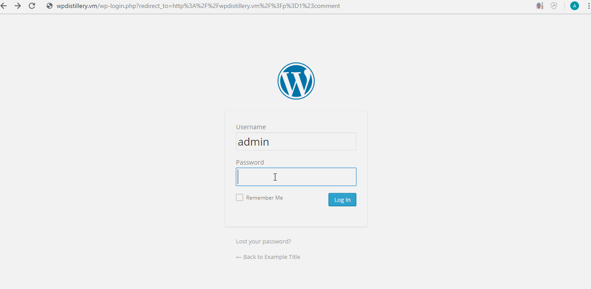
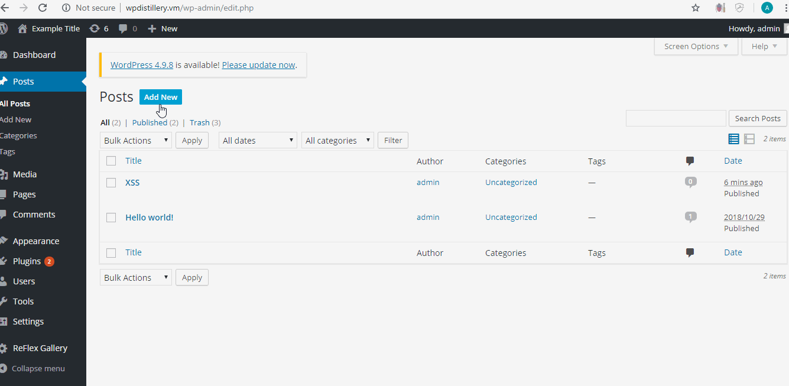
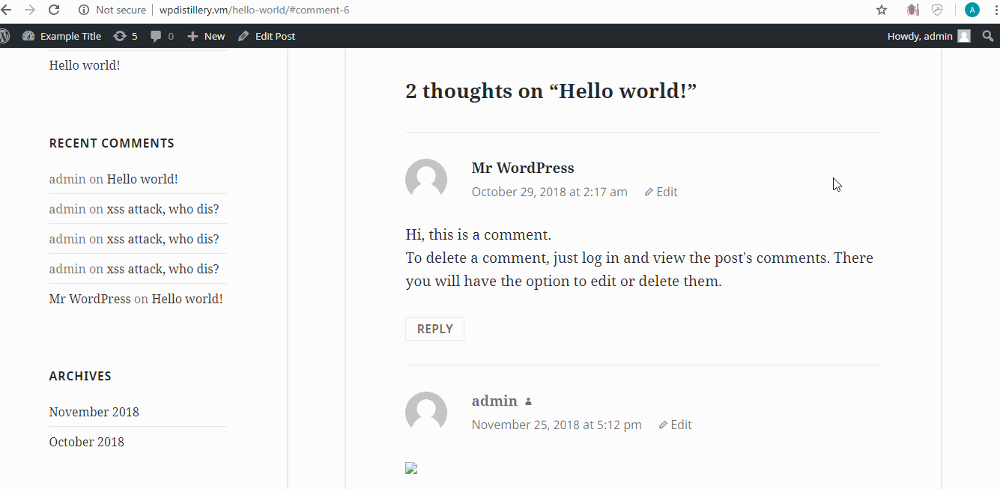

A small writeup indicating the steps you used to recreate
The types / classes of vulnerabilities involved and any related CVE identifiers
Identify affected versions and patches
Links to the source code, where possible
A screen cap

1.Http Redirects 
Tested in version 4.1
Fixed 4.2.7
Link to source code
<a href='https://github.com/WordPress/WordPress/commit/28f838ca3ee205b6f39cd2bf23eb4e5f52796bd7'>Source Code 1</a>

Steps to recreate:
visit login page, add redirect requirements, in this case I redirected to the comments page. Once logged in, will take you directily to comments

LiceCap Walkthrough
 

2.XSS
Tested in version 4.2
Fixed 4.2.5
Source Code

<a href='https://github.com/WordPress/WordPress/commit/419c8d97ce8df7d5004ee0b566bc5e095f0a6ca8'>Source Code 2</a>

Steps to recreate
Create a new post, in visual box and text box create a link with javascript, update and view page
LiceCap Walkthrough
 

3.XSS
Tested in version 4.2
Source Code
<a href='https://github.com/WordPress/WordPress/blob/master/wp-comments-post.php'>Source Code 3</a>
Steps to recreate
Go to page, create comment, post javascript
LiceCap Walkthrough

 
